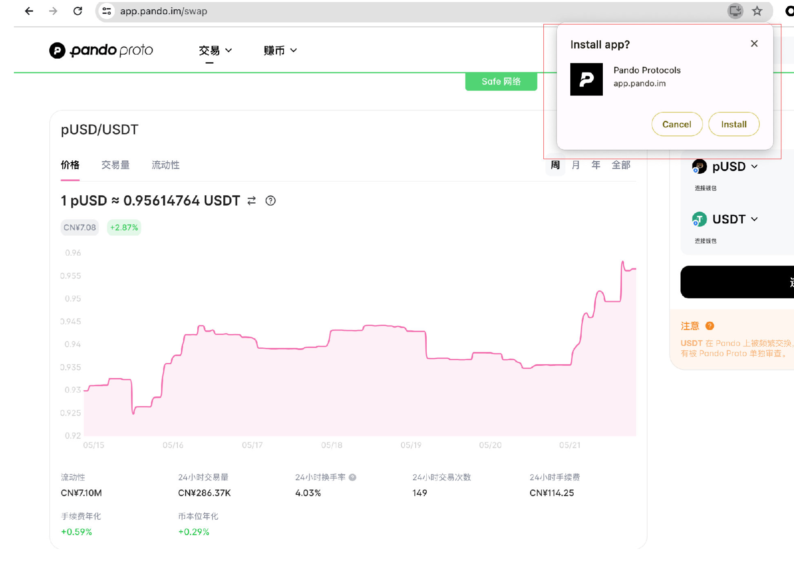
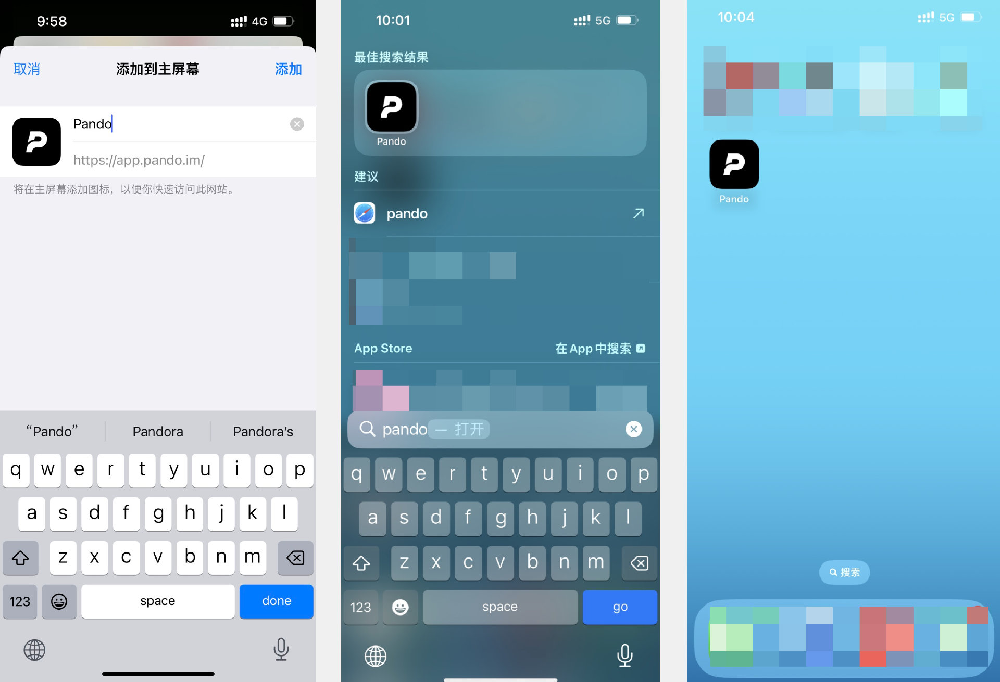

# Pando PwA 安装教程

## PwA 是什么

PwA 全称为 Progressive Web Apps（渐进式 WebApp），提供了与原生 App 相似的能力、可靠性、可安装性。无需应用商城，无需下载，直接从浏览器安装 Pando PwA 后，就可以直接在电脑桌面或者手机主屏幕像使用 app 一样打开并且使用 Pando。

## 如何在电脑桌面端安装 

首先，在浏览器地址栏中输入 Pando 官网地址 https://app.pando.im，进入页面后会在页面底部看到在设备中安装 Pando 的提示。

点击「安装」按钮，在弹出的安装确认弹窗点击「install」（安装）。

点击之后，稍等少许电脑桌面会弹出 Pando 的页面弹窗，和网页端看到的 Pando 页面相同。

在电脑桌面查找 “Pando”，可以看到名为 “Pando Protocols”的图标出现在 app 菜单里。

## 如何在 iOS 手机端安装

1）使用 Safari 浏览器

在手机的 Safari 浏览器地址栏里输入 Pando 官网地址 https://app.pando.im，点击屏幕最下方中间的按钮，在弹出的列表选择“添加到主屏幕”。

2）使用 Chrome 浏览器

在手机的 Chrome 浏览器地址栏里输入 Pando 官网地址 https://app.pando.im，点击屏幕地址栏最右边的按钮，在弹出的列表选择“添加到主屏幕”。

安装到手机主屏幕后，搜索 “Pando” 会在 app 菜单里找到 Pando PwA 。点击进入后，就可以像使用 app 一样使用 Pando 了。

## 如何在安卓手机端安装

1）使用 Chrome/Edge/Firefox 等浏览器

在浏览器地址栏里输入 Pando 官网地址 https://app.pando.im，点击页面底部的 Pando PwA 安装提示。在安装确认弹窗点击“安装”后，稍等一会儿，Pando 就安装到手机主屏幕了。在 app 列表中搜索 “Pando”，即可以找到 Pando PwA 入口。点击进入后，就可以像使用 app 一样使用 Pando 了。

2）使用安卓手机自带的浏览器

在浏览器地址栏里输入 Pando 官网地址 https://app.pando.im，在页面的底部应该会出现在设备中安装 Pando 的提示。值得注意的是，有一部分手机类型的自带浏览器不支持 PwA 下载，因此不会出现安装提示。建议如果您在手机自带的浏览器看不到安装提示更换 Chrome/Edge/Firefox 等浏览器进行安装。