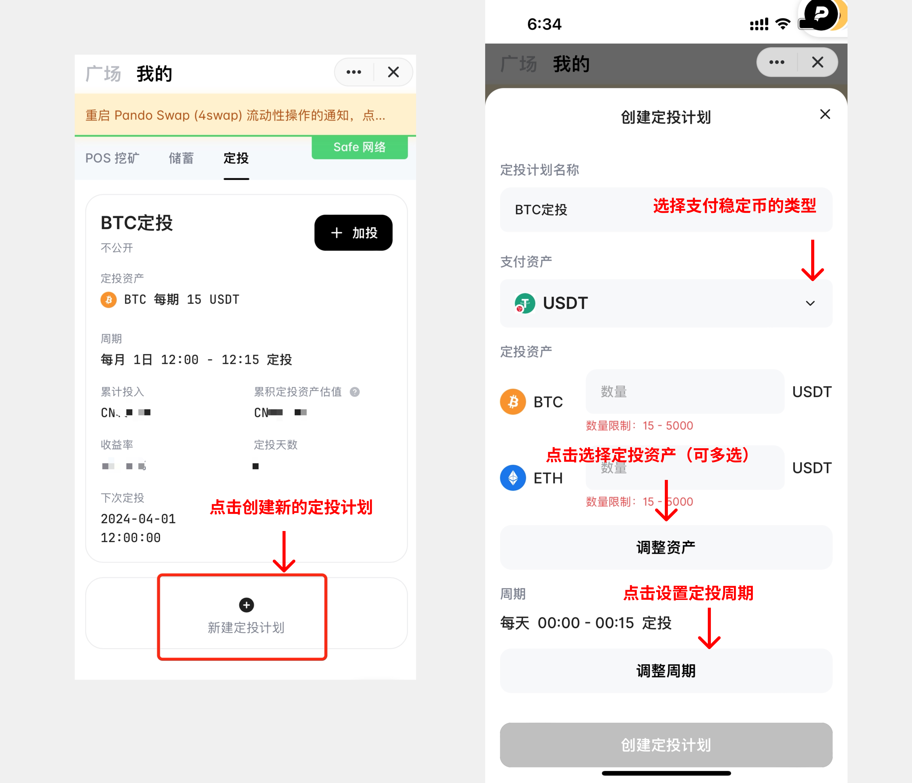
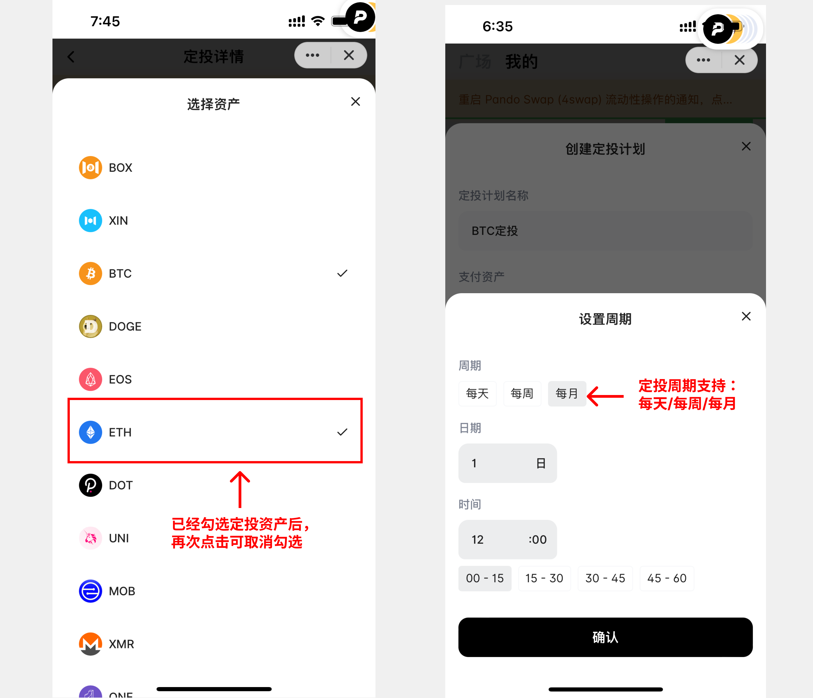
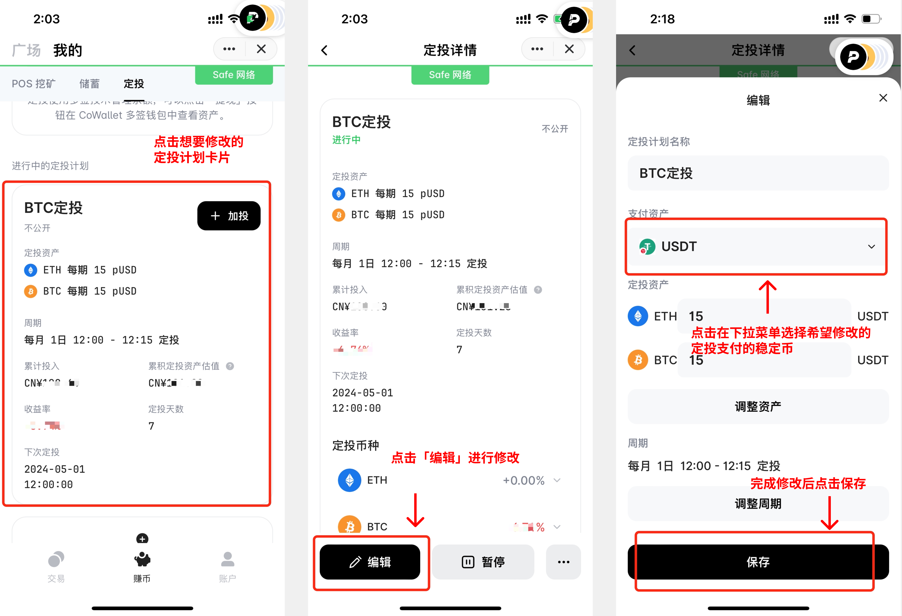
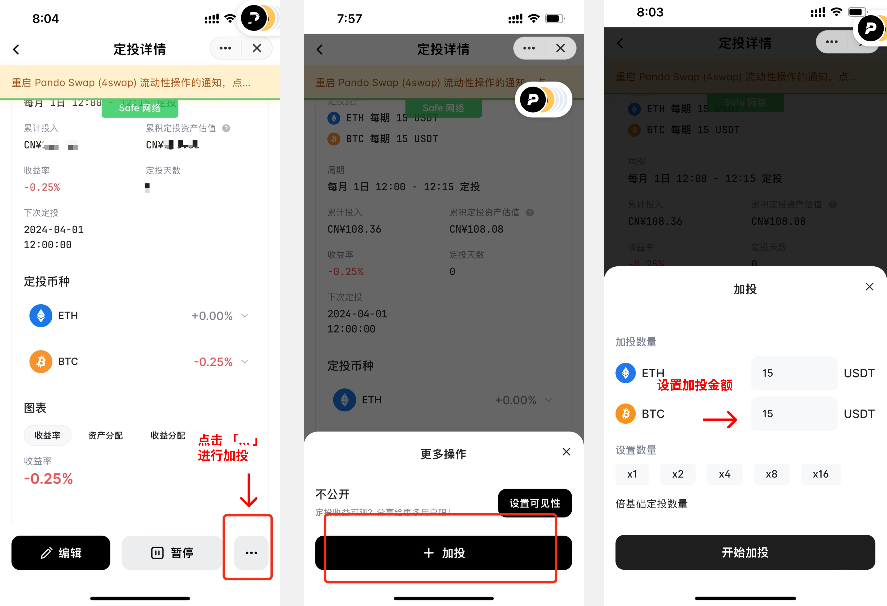
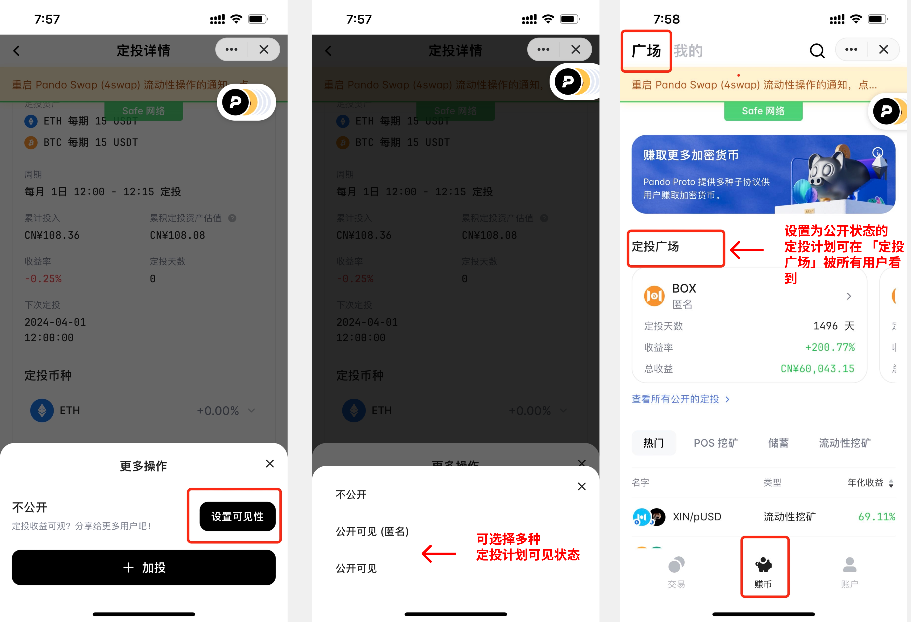
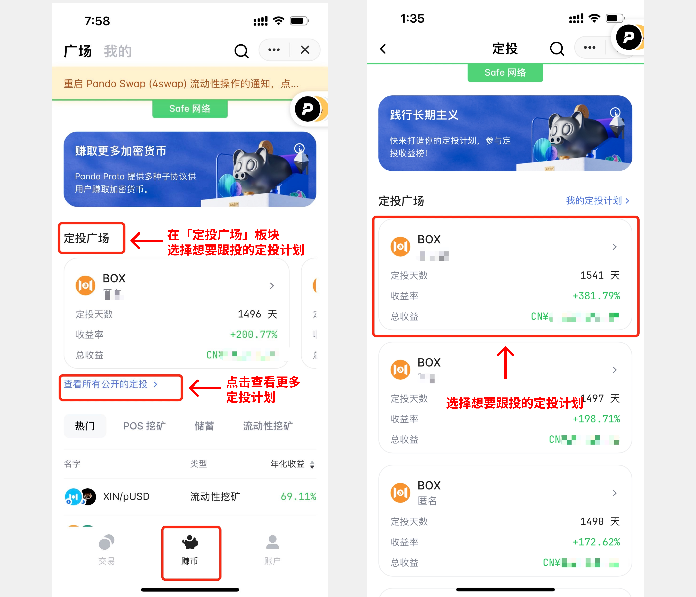
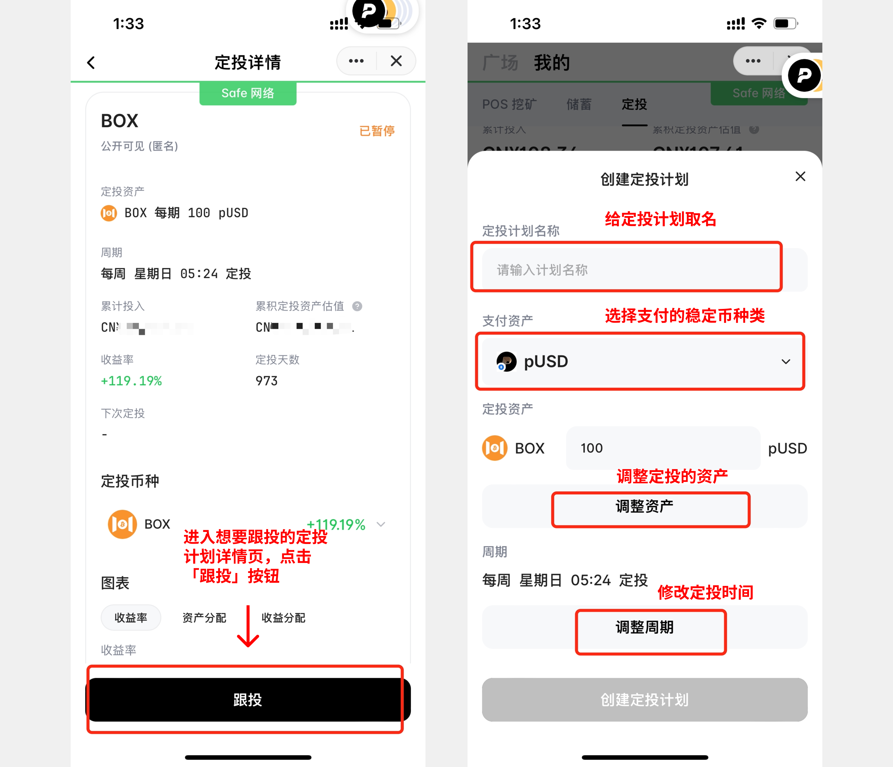
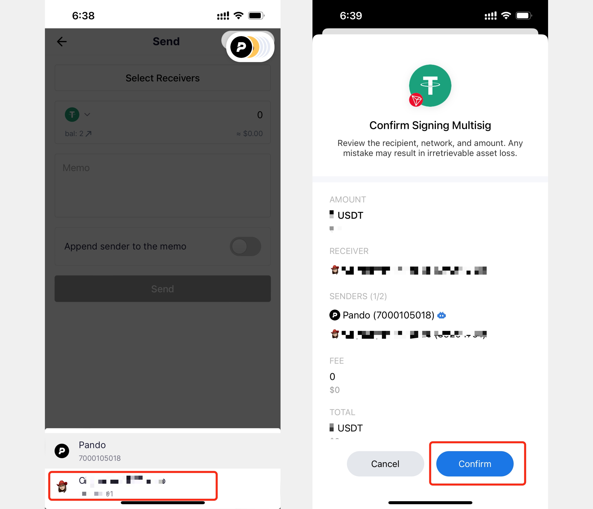

# Pando 定投计划 操作指南

## 如何创建定投计划

## 如何修改定投支付稳定币

## 如何加投

点击某进行中的定投计划卡片，在定投详情页面点击右下角的「…」按钮，在出现的弹窗中点击「+ 加投」，即可加投该定投计划下计划投资的数字货币。加投可以实现对应数字货币临时性的即时买入。

## 如何设置定投计划可见状态

点击某进行中的定投计划卡片，在定投详情页面点击右下角的「…」按钮，在出现的弹窗中点击「设置可见性」，即可设置该定投计划的可见状态。设置为「公开可见（匿名）」和「公开可见」状态的定投计划，都会出现在「广场」页面的「定投广场」板块，能被所有用户看见。

## 如何跟投

## 如何提取定投钱包里的余额

在「定投钱包余额」板块，点击「提现」，进入 CoWallet 钱包页面。第一次使用提现功能，需授权使用 CoWallet。

在 CoWallet 页面点击「发送」按钮，选择「收款人」为发送给 CoWallet 成员，选择您自己的 Mixin 钱包账户。再输入金额后， 即可发起提款。提款后的稳定币将显示在您的 Mixin 钱包账户，可点击 Mixin 钱包查询。

