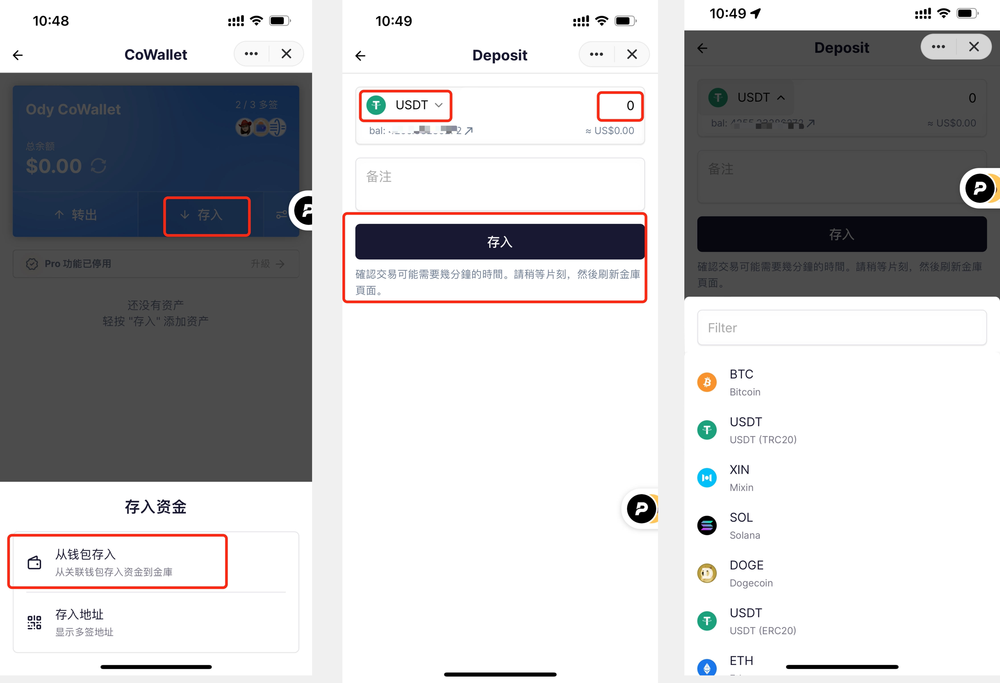

# CoWallet 多签钱包使用指南

## 如何使用 CoWallet 服务

方式一：在 Mixin Messenger 搜索机器人 ID 7000105289 找到 CoWallet，点击 + add bot 按钮就可以添加 CoWallet 机器人了。

方式二：在网页端访问 https://cowallet.pando.im/ ，用 Mixin Messenger 扫描二维码登陆 CoWallet 钱包。

## 如何创建 CoWallet 钱包

在 Mixin Messenger 创建一个群组，把和您一起管理金库（vault）的成员都加进群，将群名称改成 xxx^n 格式。其中 xxx 为钱包名称，n 为多重签名阈值。

假设现在我要和两个朋友共同管理一个多签钱包，那么第一步，点击 Mixin Messenger 聊天页面右上角的个人头像，点击菜单栏的「新群聊」，创建新群聊，将共管人员和 CoWallet 机器人（7000105289）添加为群成员：

在本例中，如上图群名为 “Ody CoWallet^2“，群里总共 4 名成员，其中有 1 名是 CoWallet 机器人，剩下 3 名是能够参与多签的人。

点击群聊左下角的加号‘+’, 然后点一下 CoWallet 机器人按钮，就可以打开刚刚创建的金库。

到这里多签钱包就创建好了。

现在我与我的 2 位朋友拥有了一个 3 个人共同管理的多签金库（Vault），只要任意 2 个人参与签名，就可以打开金库（Open Vault），取出资产。

需要注意的是，刚创建好的金库其余的多签共同管理者打开自己的 CoWallet 机器人，还无法看见已经创建好的金库（Vault）。其余的多签共同管理者需要先引入金库。

## 如何引入金库

首先，多签钱包的创建者需要导出金库 JSON 文件。

点击打开金库，点击「存入」（Deposit）按钮右侧的小按钮导出JSON配置文件，然后复制 JSON 文档，发送给多签共同管理人。

当多签共管人收到 JSON 文档后，复制文档，然后打开 CoWallet（7000105289），点击“+”，选择「导入群组钱包」，在出现的弹窗中粘贴上刚刚复制的 JSON 配置文档，点击「打开」按钮确认。

回到 CoWallet 主页，就可以看到金库成功导入。

## 如何存入资产

点击已经创建好的多签钱包，点击 「存入」，在出现的弹窗点击「从钱包存入」。选择要存入的资产并输入金额，添加备注后，点击「存入」确认转账。

请注意，因为 CoWallet 需要在最新的 Mixin Messenger 版本下运行，所有多签管理人的 Mixin Messenger app 需要升级到最新的版本（V1.8.2），否则多签钱包将无法成功收到存入的资产。

## 如何转出资产给多签管理者

点击「转出」-「选择接收人」，在出现的弹窗选择「发送给金库用户」。选择接受资产的用户，选择并输入转账的金额和币种后，就可以发起转账。

根据多签钱包设置的签名数量要求，需要对应数量的其他多签钱包共管人进入到多签钱包，点击资金转出请求，进行签名确认后资金才可以完成转出。

比如，以上举例的多签钱包 “Ody CoWallet”, 转出需要3个共管钱包中的2个完成签名。

签名数量要求满足后，对应的收款人就可以在 Mixin 钱包中收到转账了。

## 如何进行多签钱包到 MIX 多签地址的转账

点击「转出」-「选择接收人」，在出现的弹窗选择「发送给 MIX 地址」。把收款的 MIX 多签地址填入出现的弹窗空格内，确认发起转账，并且满足多签钱包签名数量要求的其他多签共管人完成签名后，收款人就可以收到转账了。

如果收款地址为多签钱包地址，地址可以通过进入对应多签钱包，点击「存入」，在出现的弹窗选择「存入 MIX 地址」，复制对应的以 “MIX”开头的地址。

如果收款地址为某用户 MIX 地址，可以请收款用户打开 CoWallet 机器人，点击左上角的头像，点击 ”我的 MIX 地址“ 把 MIX 地址复制出来，再把地址发送给您。

## Pro 功能

进入多签钱包，点击「升级」并完成支付就可以解锁 Pro 功能。当前 Pro 计划的价格是 10 USDT/月，请注意支付的币种目前仅支持 USDT-ERC20，支付之前需要确保您的 Mixin 钱包中有足够数量的 USDT-ERC20。

Pro 计划专享的功能目前包括：

- **地址簿功能，保存并直接使用常见转账地址**

只要用户有至少一个多签钱包购买了 Pro计划，您名下的所有多签钱包可以共享地址簿功能。

进入 CoWallet 机器人，点击页面左上角的头像，既可以找到地址簿的入口。

- **支持不同设备之间同步多签钱包的数据**

如果手机端创建了 Pro 计划的多签钱包，电脑端打开 CoWallet 不用手工导入钱包，直接就会同步该钱包的所有数据。

- **私人 API 服务，多签钱包将拥有更快的加载速度**

- **Pando 团队的优先客服服务**

- **精选的钱包背景图片**
