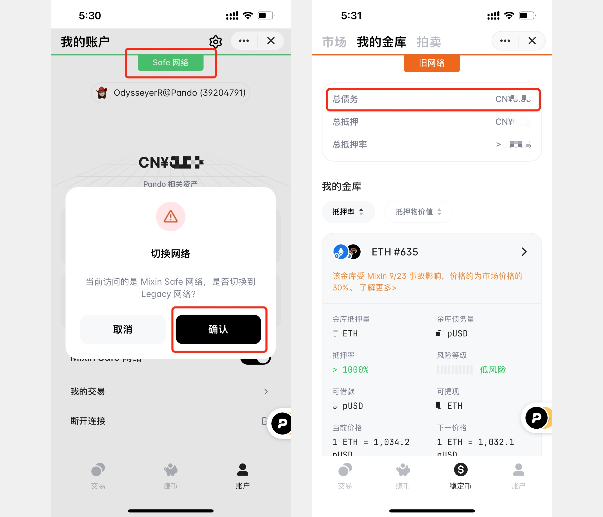
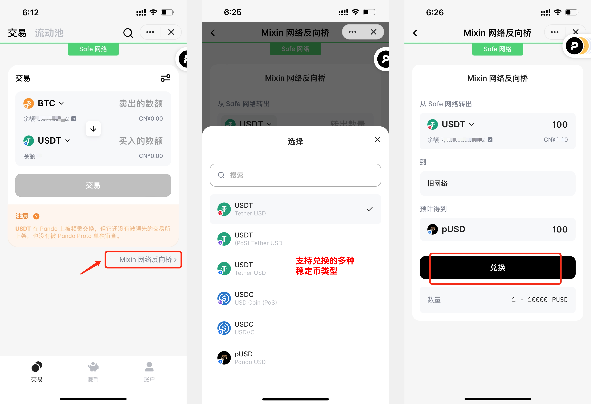
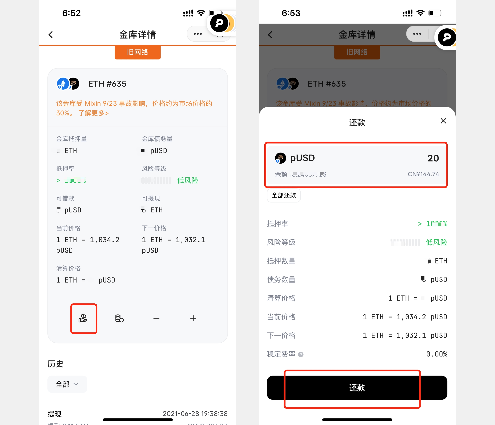

# 偿还旧主网 Pando Leaf pUSD 贷款 操作指南

在Mixin 旧主网 Pando Leaf 里还有 pUSD 贷款，应该如何偿还呢？

## 第一步 查看您在旧主网 Pando Leaf 里 pUSD 债务的金额

您可以打开 Pando （@7000105018）机器人，点击「Safe 网络」 切换为 「旧网络」后，选择最下方菜单栏的「稳定币」-「我的金库」板块，查看您的总债务金额和各个金库分别的债务金额。您也可以直接打开 Pando Leaf （@7000103924）机器人，打开后跳转的是和按以上步骤在 Pando 机器人里打开看到的同一个页面。

## 第二步 请检查您是否有足够的pUSD 来偿还贷款

点击 Safe Network Migration（@7000104743）对话窗机器人检查您在 Mixin 旧主网钱包里是否有足够的 pUSD 来偿还 Pando Leaf 贷款。如果有足够的 pUSD 您可以直接按以下「偿还 Pando Leaf 贷款」的步骤指引进行偿还。

点击新版本的 Mixin Messenger 聊天列表界面，选择 「钱包」查看新主网上 Mixin钱包里是否有足够的 pUSD或者其他类型的稳定币。如果有足够的pUSD或者其他类型稳定币，请按照以下 「使用 Mixin 网络反向桥」的步骤指引把新主网的稳定币资产 （所支持的稳定币资产类型包括 pUSD、 USDT (TRC-20)、USDT（ERC-20）、USDT（Polygon）、USDC（ERC-20）、USDC（Polygon）六种）转换成旧主网 pUSD 上用于偿还 Pando Leaf 贷款。

如果您在新主网上 Mixin 钱包里没有足够的 pUSD或者其他类型的稳定币，您需要用其他的数字货币进行兑换。

## 第三步 兑换 pUSD

您可以使用 Pando （@7000104743）的交易功能，或者 ExinOne （@7000101276）把其他数字资产换成 pUSD以及以上所支持类型的稳定币。

## 第四步 使用 Mixin 网络反向桥 将新主网稳定币转为旧主网 pUSD

打开 Pando （@7000104743）机器人，在「交易」页面点击「Mixin 网络反向桥」，选择想要进行兑换的新主网稳定币资产类型，点击「兑换」按钮，获得等值的旧主网 pUSD。

## 第五步 偿还 Pando Leaf 贷款

按照「第一步」的步骤指引打开 Pando Leaf 「我的金库」页面，点击需要偿还贷款的具体金库。点击「偿还」按钮，输入想要还款的金额，即可完成还款。

