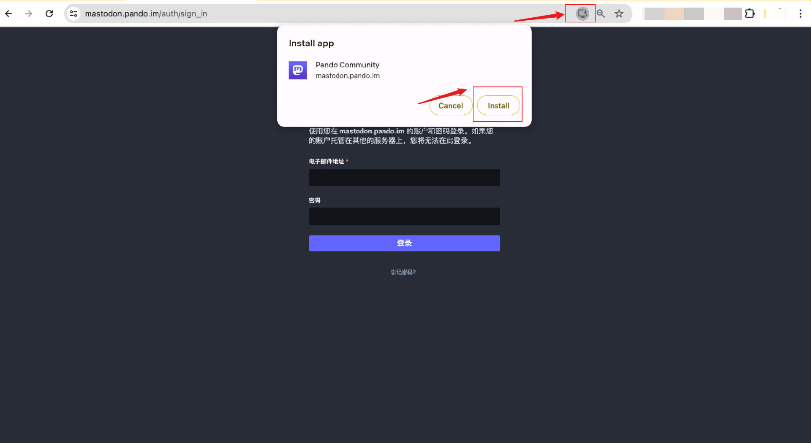

# Pando 投资者社区加入指南

指定社群的成员拥有加入专属 Pando 投资者社区的权限，解锁更全面多样的投资品种、资讯和服务。

## 第一步 检查您是否具有加入 Pando 投资者社区的权限

您需要是 Mixin 社群「定投人生」（Mixin ID @7000102069）的社群成员。非社群成员不具有加入 Pando 投资者社区的资格。

## 第二步 加入 Pando 投资者社区

在 Mixin Messenger 中打开 Pando （@7000105018）机器人，或网页端登录 Pando 官网 (https://pando.im)，连接 Mixin 钱包后点击 「账户」页面，找到「社区」入口

- 如果是首次使用社区功能，请先点击 「点此注册」
- 如果已经注册过了，点击「去绑定」。

### 注册社区账户

在出现的弹窗中点击注册的入口，确认 Pando Mastodon 投资者社区的规则后，输入邮箱地址和密码进行注册。

前往您刚刚输入的邮箱点击确认邮件中的链接进行注册确认后，您就注册好了 Pando 的投资者社区。

### 绑定社区账户到 Pando

回到 Pando 机器人或者官网的 「账户」页面，再次点击「社区」入口，在出现的弹窗中点击「去绑定」，同意授权后就进入了 Pando 投资者社区。

## Pando 投资者社区 成员资格

目前 Pando 投资者社区 仅面向「定投人生」社群成员开放。

:::warning 
请注意如果您「定投人生」社群会员资格到期未续费，或者您退出定投社群后，您也会同时失去 Pando 投资者社区的登入权限，如果您续费「定投人生」社群后，Pando 投资者社区的登入权限也会自动恢复。
:::

## 安装 Pando 投资者社区 PwA 

### PwA 是什么

PWA 全称为 [Progressive Web Apps（渐进式 WebApp）](https://web.dev/explore/progressive-web-apps?hl=zh-cn)，提供了与原生 App 相似的能力、可靠性、可安装性。无需应用商城，无需下载，直接从浏览器安装 Pando 投资者社区的 PWA 后，就可以直接在电脑桌面或者手机主屏幕像使用 App 一样打开并且使用 Pando 投资者社区。

### 如何在电脑桌面端安装

在 Chrome 浏览器输入 Pando 投资者社区的网址 https://mastodon.pando.im。点击地址栏的「安装」图标，在弹出的安装确认弹窗点击「install」（安装）。

点击之后，等待少许电脑桌面会弹出 Pando 投资者社区 的页面弹窗，也网页端看到的相同。

在电脑桌面查找 「Pando Community」，可以看到名为 “Pando Community” 的图标出现在应用程序的菜单栏。

### 如何在 iOS 手机端安装

1）使用 Safari 浏览器

在手机的 Safari 浏览器地址栏里输入 Pando 投资者社区的网址 https://mastodon.pando.im，点击屏幕最下方中间的按钮，在弹出的列表里选择“添加到主屏幕”。

2）使用 Chrome 浏览器

在手机的 Chrome 浏览器地址栏里输入 Pando 投资者社区的网址 https://mastodon.pando.im，点击屏幕地址栏最右边的按钮，在弹出的列表选择“添加到主屏幕”。

安装到手机主屏幕后，搜索 “Pando Community” 会在应用程序菜单里找到名为“Pando Community”的图标。点击进入后，就可以像使用 app 一样便捷地使用 Pando 投资者社区了。

### 如何在安卓手机端安装

1）使用 Chrome/Edge/Firefox 等浏览器

在浏览器地址栏里输入 Pando 投资者社区的网址 https://mastodon.pando.im，点击浏览器菜单栏里的「安装应用」。在安装确认弹窗点击“安装”后，稍等一会儿，Pando Community 就安装到手机主屏幕了。

2）使用安卓手机自带的浏览器

请注意，有一部分手机类型的自带浏览器不支持 PWA 下载，因此不会出现安装提示。建议如果您在手机自带的浏览器的菜单栏找不到安装提示，请更换 Chrome/Edge/Firefox 等浏览器进行安装。

