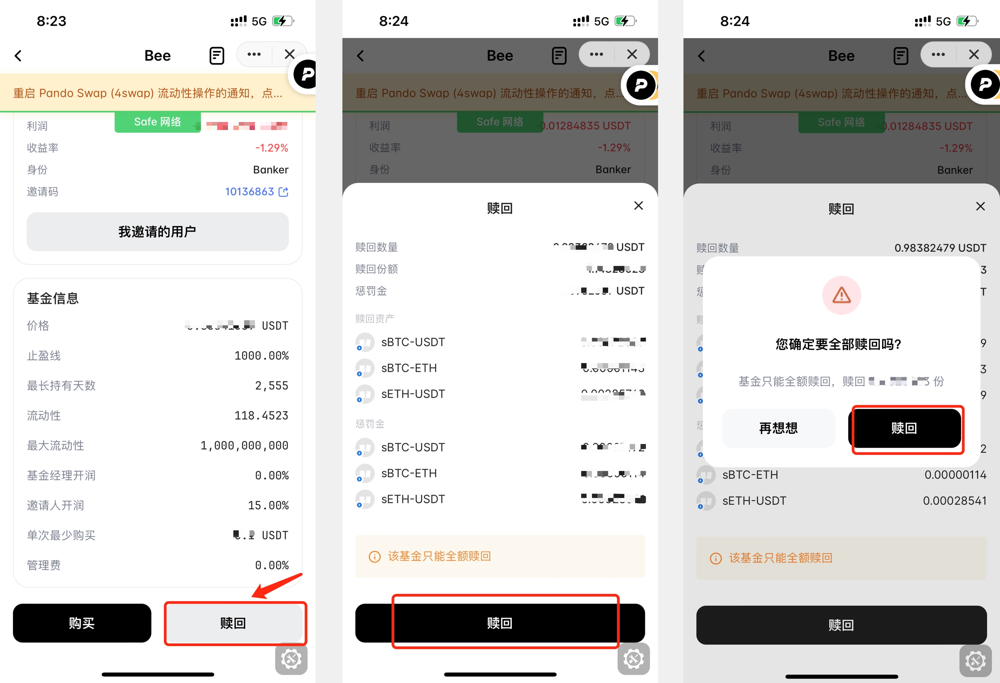

# 新版 Bee.holdings 使用指南

Bee.holdings 是 Pando 提供的基金产品，每一份额的 Bee Holdings 基金的组成当前 36.67% 为 sBTC-USDT 代币，31.44% 为 sBTC-ETH 代币，31.89% 为 sETH-USDT。

Bee.holdings 现已整合进入 Pando 机器人（Mixin ID：7000105018），买入和赎回都可在 Pando 机器人中操作。

## 如何进入 Bee.holdings 页面

进入 Pando 机器人 (@7000105018) ，切换到 「赚币」页面，在「广场」页面点击 「Bee」列表，即可找到 Bee.holdings 产品列表。

名为 “Bee Holdings”的基金可以进行购买和赎回；名为 ”Bee Holdings (旧版)“ 的基金为 Mixin 攻击事件发生后从旧主网迁移到 Safe 新主网的基金产品，当前无法再买入，仅支持赎回。

## 如何进行申购

点击 “Bee Holdings”基金产品，即可进入基金申购页面。

点击「购买」，输入申购的数量，并保持 Mixin 钱包里有对应数量的 USDT即可支付完成申购。

请注意首次申购的金额不得少于 50000 USDT，第二次之后的申购金额单次不得少于 1000 USDT。

「人生最重要的一课」（Mixin ID: ）社群成员拥有 banker（定投银行家）身份，自动获得了基金申购资格。不在该社群的用户，可以向拥有邀请码的用户获得邀请码，获得资金申购资格。完成申购后，身份将为 “holder” (持有者)。

请注意首次申购的金额不得少于 50000 USDT，第二次之后的申购金额单次不得少于 1000 USDT。

「人生最重要的一课」（Mixin ID: 7000104052）社群成员拥有 banker（定投银行家）身份，自动获得了基金申购资格。不在该社群的用户，可以向拥有邀请码的用户获得邀请码，获得资金申购资格。完成申购后，身份将为 “holder” (持有者)。

## 如何查看申购详情

每次申购完成后，可以在申购页面的「操作记录」板块找到对应的申购记录条，点击后就会显示申购详情，包括申购金额、申购份额、购入资产种类等信息。或者也可以点击申购页面顶部形状为「列表」的图标查询您的历史申购记录。

您也可以进入「账户」页面，点击「Bee」板块，同样可以查询到当前申购的情况。

## 邀请他人申购

如果您已经是「人生最重要的一课」（Mixin ID: 7000104052）社群成员，进入申购页面可以在「我的份额」板块看到「邀请码」。点击「分享」图标就可以邀请他人申购。当前支持以链接或者发送 Mixin 联络人的方式进行分享。

## 如何进行赎回

赎回氛围分为自动赎回和主动赎回。赎回会产生分润，分润将会分给邀请人，目前给 banker 的分润是 15%。

**自动赎回**

自动赎回分为两种，一种是最长持有时间天数后系统会自动赎回，另外一种是当收益达到了止盈线后，会自动赎回。这两种赎回均为全部赎回。目前，定投银行家的最长持有时间为 7 年（即 2555 天），收益率的止盈线为 1000%。

**主动赎回**

主动赎回只支持全部赎回，且会产生罚金，**罚金 = (当前净值 - 分润) * 罚金率 * ((到期日 - K) / (到期日 - 首次购入日))**，其中 K 是从第一次投 到 现在 的天数。

目前定投银行家的罚金率为 10%，如果赎回时有收益，那么需要先扣除分润，然后再扣除罚金，也就是提前赎回的用户拿到的币 = 当前净值 - 分润 - 罚金

举例说明：如果自动赎回的年数 是 7 年，罚金率是 10%，分润是 15%，假如用户 A 投了 100k USDT，只过了 1 年，他的净值是 200k USDT，那么分润是 15000 USDT，罚金 = (200000 - 15000 ) 0.1 ((2555 - 365) / 2555) = 15857.14 USDT

Banker 邀请的人主动赎回，罚金的一部分会分给 Banker。

赎回后同样可以在申购页面查看赎回记录，每次赎回成功，同样可以在聊天窗口查看赎回记录。

