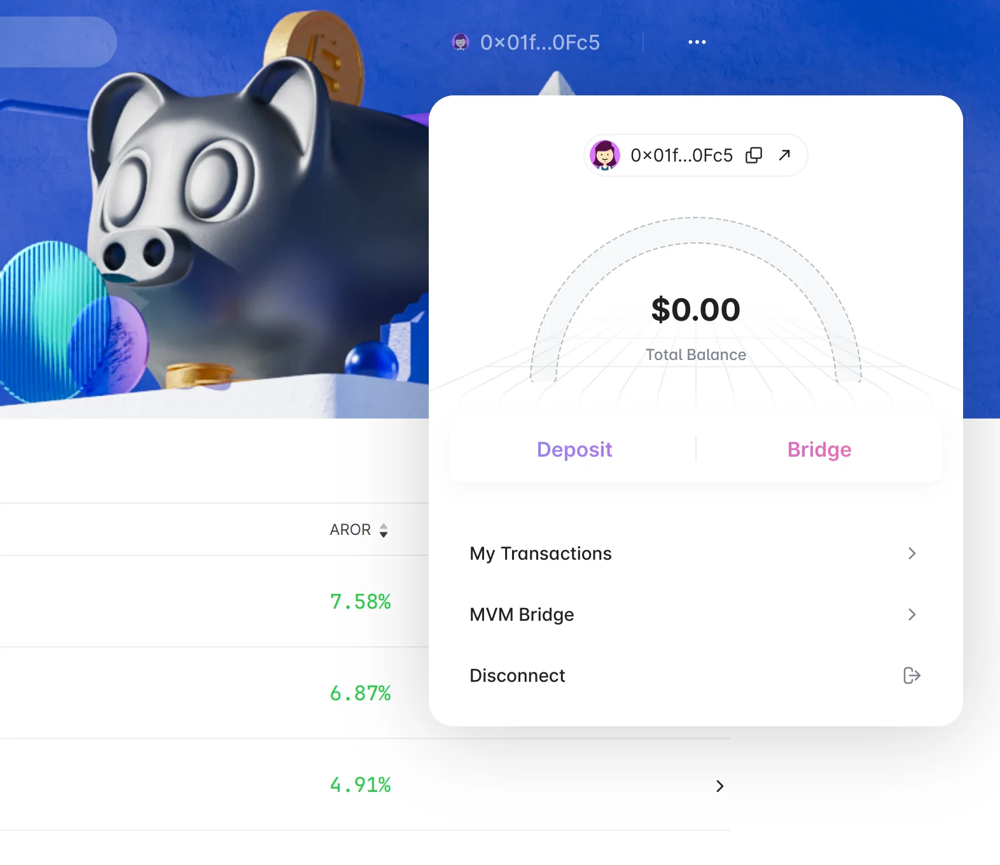
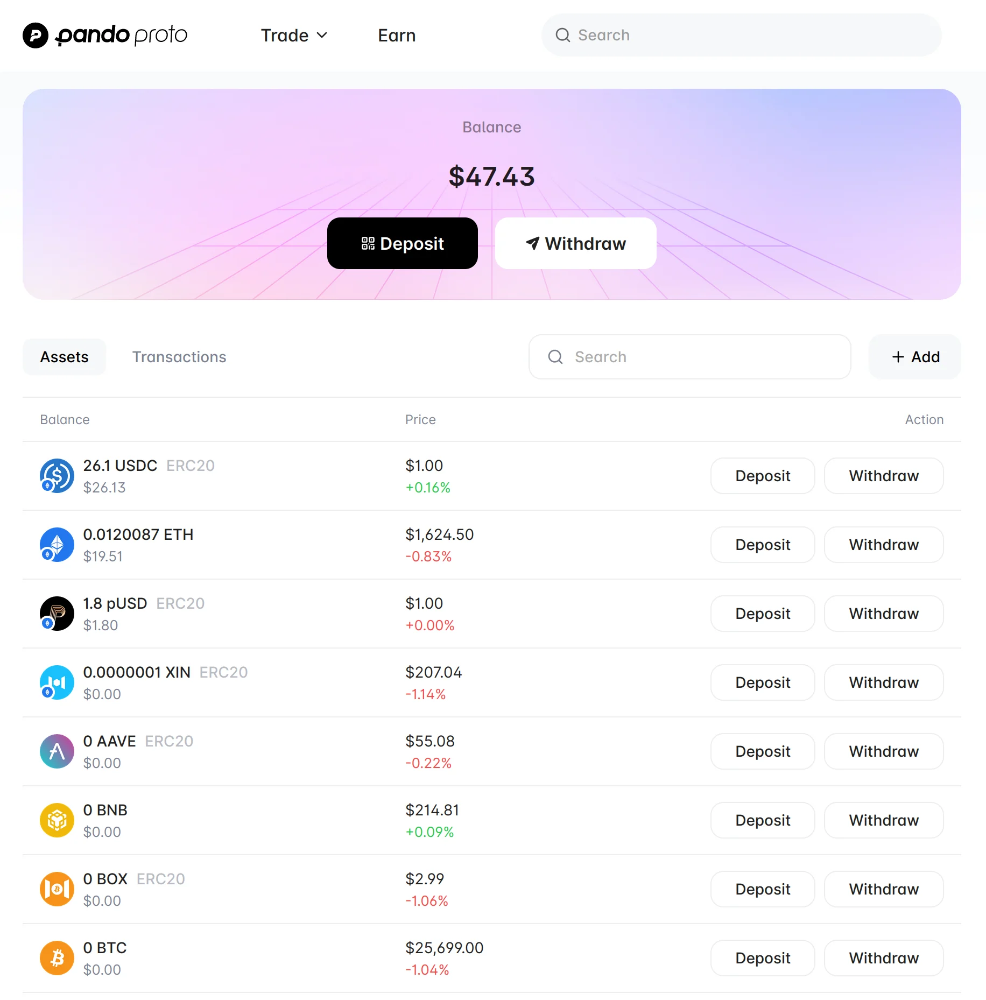

# Pando Bridge

As we know, Pando is a protocol set based on [Mixin Network](https://mixin.network), which means Pando has a comprehensive support for Mixin's EVM compatible virtual machine, aka [Mixin Virtual Machine (MVM)](https://mvm.app/).

Thanks to MVM, users can connect with Pando with their familiar EVM compatible wallets, such as Metamask.

To improve the user experience of MVM users, we have developed a bridge to connect Pando with MVM, which is called Pando Bridge.

## What is Pando Bridge?

Pando Bridge is a built-in bridge that help users connects Pando with MVM. It's not a standalone product, but a part of Pando. 

When you visit https://app.pando.im and connect with Metamask or OneKey, you will see a button called "Bridge" on the top right corner of the page.

Tap the button, you will see a view like this:

That's the Pando Bridge.

## How we improve the user experience?

Pando Bridge is very similar to MVM's official bridge, but there is a significant difference is that:

You don't need to connect twice anymore -- In the past, you need to visit MVM's official bridge and connect it, after you connect with Pando to manage your assets, which is very annoying.

However, now the Pando Bridge is already connected with your wallet after you connect with Pando, so smooth!

### Some other improvements

We also made some other improvements to make the user experience better: for example, the deposit and withdraw process is more clear and easy to understand.

MixPay deposit has been integrated into the deposit process, so you can deposit your assets to Pando Bridge with MixPay directly.

Withdraw fee is often full of uncertainty and hard to figure out, so we added a "Swap" button to help you swap some fees if you don't have enough to pay for withdrawal.

For the senario that you want to withdraw all amount of a giving asset, a auto calculation is also added to help you calculate the amount of assets you can withdraw after the fee is deducted.

